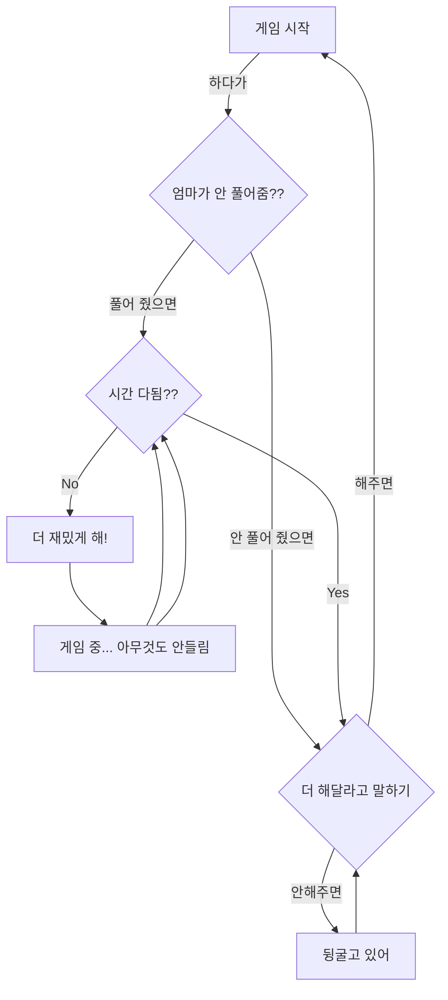

```mermaid
flowchart TD

    A[게임 시작] -- 하다가 --> H{엄마가 안 풀어줌??}
    H -- 풀어 줬으면 --> B{시간 다됨??}
    H -- 안 풀어 줬으면 --> E
    B -- No --> D[더 재밌게 해!]
    D --> G[게임 중... 아무것도 안들림]
    B -- Yes ----> E{더 해달라고 말하기}
    E -- 해주면 --> A
    E -- 안해주면 --> F[뒹굴고 있어]
    F --> E
    G --> B
    G --> B
```
